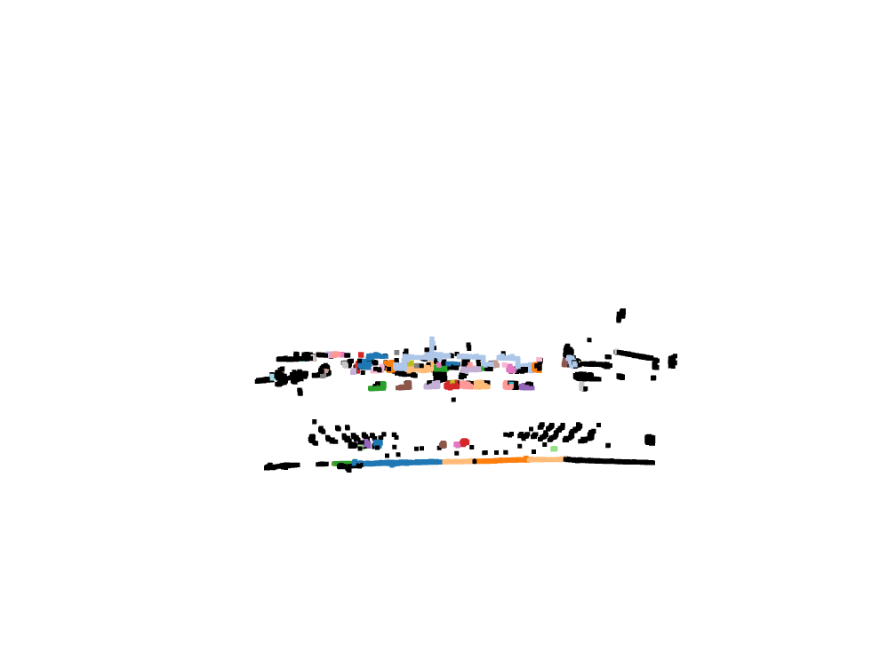
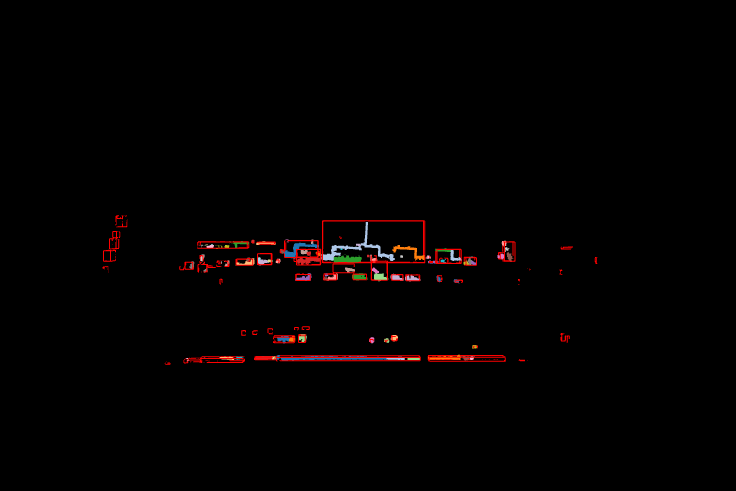

# LIDAR Data Analysis and 3D Object Tracking using Python + Open3D

This project implements an end-to-end pipeline for analyzing LIDAR sensor data, segmenting 3D objects using clustering, and tracking them across frames using a centroid-based tracker.

## Dataset
- **KITTI Vision Benchmark** (raw velodyne point clouds) [Link to download](https://www.cvlibs.net/datasets/kitti/raw_data.php)

## Project Pipeline
1. **LIDAR Data Loading** (`.bin` → numpy array)
2. **Preprocessing**: Outlier removal, range filtering
3. **Clustering**: DBSCAN for object segmentation
4. **Bounding Boxes**: Axis-Aligned 3D boxes
5. **Tracking**: Centroid-based multi-object tracking
6. **Visualization**: Animated Open3D viewer & video export

## Technologies Used
- `Python`
- `Open3D`
- `NumPy`, `SciPy`, `Matplotlib`
- `DBSCAN` from `scikit-learn`

## Sample Output

#animate.py

#visualize.py

## How to run the project
1. Download the data from the above link.
2. Run data_load.py to see if the data is loaded correctly
3. Run preprocess.py to save the filtered point cloud data in your directory
4. Run animate.py to visualize the filtered point cloud data
5. Run bounding_box.py and then tracking.py these will store the unique labels in .json format to detect and track objects
6. Run visualize.py to see the tracking and detection in action.

## Note:
This project is still not perfect I will update this as I learn

##  Future Scope
To make a Lidar Data Processing Pipeline.
